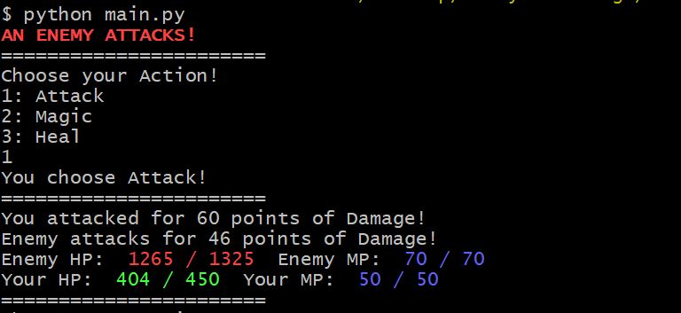

## How to Run 

Make sure to have [Python](https://www.python.org/) installed. Download the entire package onto your computer and `cd` into the `Battle` folder. Then run the `main.py` file with this command: `python main.py`. Directions may slightly differ depending on the type of system you are running this on. This program was made using Python 3.7.0 on Windows OS.

**NOTE:** Don't run this program with the Windows Command Prompt. It will still work but the colors don't show up correctly. This is how the program should look at start.

## To Win the Game
Your only goal is to reduce your enemies HP to 0. If your HP reaches 0, you lose. If both you and your enemies HP both reach 0 on the same turn, you still lose. There are certain mechanics in the game that I'll let you figure out on your own. Good luck.

